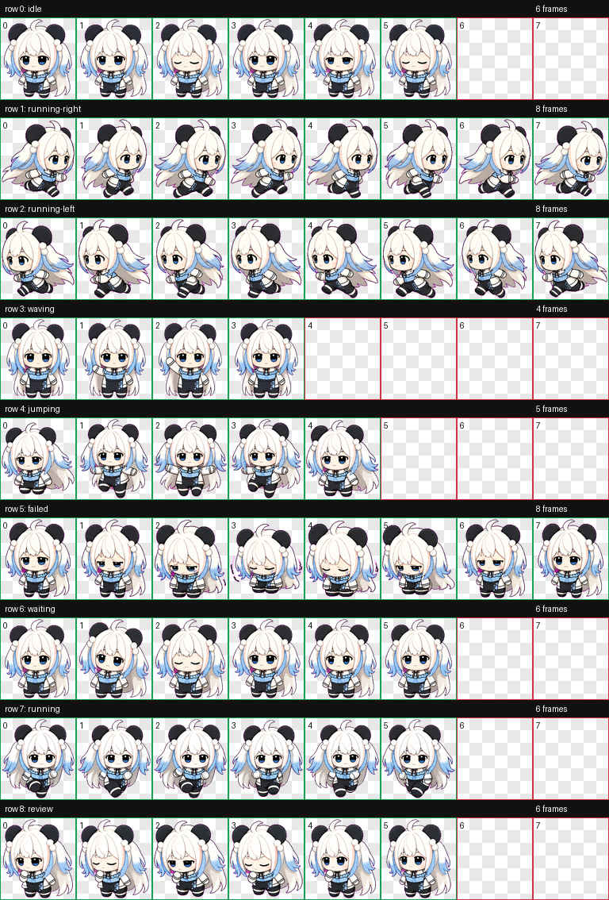
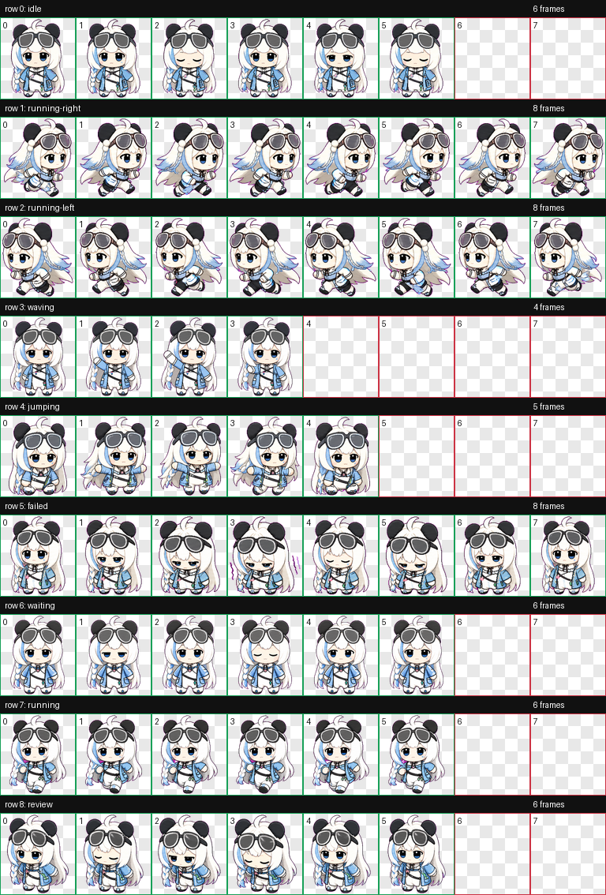

# ShadowLee Codex Pets

[中文](README.md) | [English](README.en.md)

This repository contains two custom animated pets for Codex Desktop:

- `ShadowLee`: a white-and-blue chibi plush pet with black round ear buns.
- `ShadowLeeGlasses`: a sunglasses-wearing ShadowLee variant.

Each pet is packaged in its own folder and can be installed independently or side by side.

## Preview

### ShadowLee



### ShadowLeeGlasses



## Install

Choose the pet to install in PowerShell:

```powershell
$pet = "ShadowLee"
# Or:
# $pet = "ShadowLeeGlasses"

$dest = Join-Path $env:USERPROFILE ".codex\pets\$pet"
New-Item -ItemType Directory -Force -Path (Split-Path $dest) | Out-Null
Remove-Item -LiteralPath $dest -Recurse -Force -ErrorAction SilentlyContinue
Copy-Item -LiteralPath ".\pets\$pet" -Destination $dest -Recurse
```

Then restart Codex Desktop or refresh the pet selector, and choose the installed pet.

## Files

```text
pets/
  ShadowLee/
    pet.json
    spritesheet.webp
  ShadowLeeGlasses/
    pet.json
    spritesheet.webp
previews/
  ShadowLee/
    contact-sheet.png
    review.json
    validation.json
  ShadowLeeGlasses/
    contact-sheet.png
    review.json
    validation.json
catalog.json
scripts/
```

## Validate

```powershell
python .\scripts\validate_catalog.py
```

Expected result:

```text
catalog ok: 2 pet(s)
```

## Contract

Both spritesheets follow the current Codex custom pet contract:

- Format: WebP with alpha.
- Dimensions: `1536x1872`.
- Grid: 8 columns x 9 rows.
- Cell size: `192x208`.
- Unused cells are fully transparent.

## Notes

- Both pets were generated with OpenAI's `hatch-pet` workflow.
- `running-left` was derived by mirroring `running-right` to preserve gait consistency.
- Preview and QA files are stored under `previews/<pet-id>/`.
- This repository only contains local Codex Desktop custom pet packages. It does not include Codex Desktop itself.
